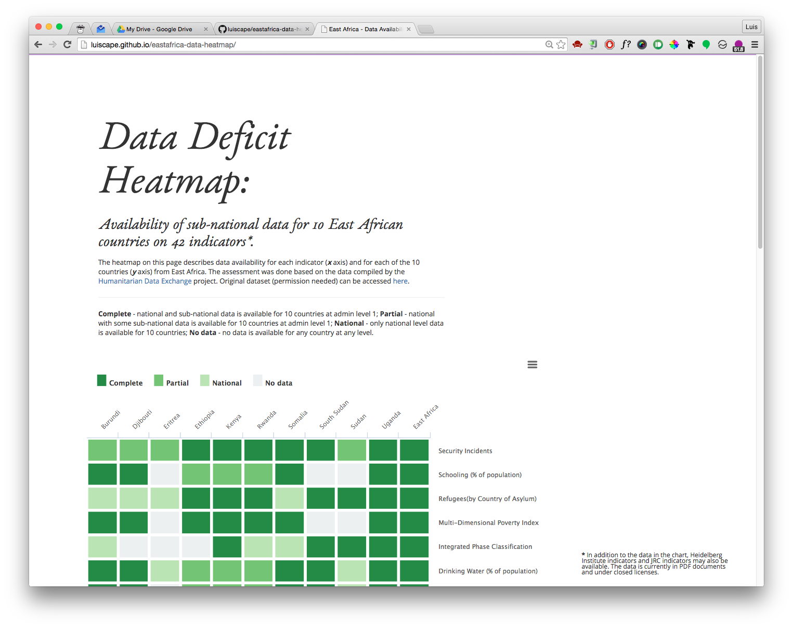

## East Africa Data Heatmap
Heat map of data availability for 10 East African countries on 42 indicators. The objective of the map is to visualize what indicators contain data and what don't at different levels of disaggregation.

